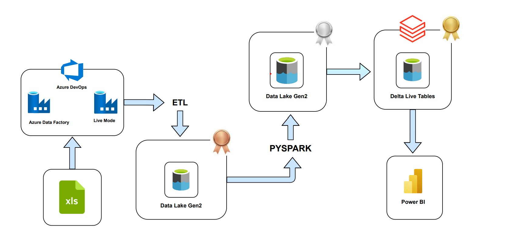

# Azure End-to-End Data Engineering Project with Devops

## Architecture



## Overview
This project implements a real-time, scalable, and structured data pipeline using Azure Databricks, PySpark, and Delta Live Tables (DLT) to process and analyze Olympic dataset entities such as athletes, coaches, events, and NOCs. The architecture follows a Medallion design pattern (Bronze, Silver, Gold) to manage raw, cleansed, and business-level aggregated data respectively.

## Medallion Architecture

  * Bronze Layer: Raw ingestion from CSV files via ADF into ADLS Gen2.
  * Silver Layer: Cleansed & transformed datasets using PySpark.
  * Gold Layer: Aggregated & business-use-case ready datasets using DLT pipelines.

### Phase 1: Bronze Layer – Raw Ingestion

  * Ingest CSV data from Azure Blob Storage/ADLS Gen2 using ADF pipelines in live mode.
  * Save raw data as-is into Delta format in the bronze layer.
  * Maintain schema evolution using autoloader for streaming ingestion (optional for streaming data).

### Phase 2: Silver Layer – Data Transformation in PySpark

1. Read Data

   ```
    df = spark.read.format('delta').load('abfss://.../bronze/athletes')
   ```

2. Null Value Handling

   ```
    df = df.fillna({"birth_place":"xyz", "birth_country":"abc"})
   ```
   
3. Filtering by Specific Names

    ```
    df_filtered = df.filter((col('current') == True) & (col('name').isin('name1','name2')))
    ```

4. Type Conversion

    ```
    df = df.withColumn('height', col('height').cast(FloatType()))\
         .withColumn('weight', col('weight').cast(FloatType()))
    ```

5. Sorting by Multiple Columns

    ```
    df_sorted = df.sort('height','weight', ascending=[0,1]).filter(col('weight') > 0)
    ```

6. Abbreviation

    ```
    df_sorted = df_sorted.withColumn('nationality', regexp_replace('nationality','United States','US'))
    ```

7. Finding Duplicates

   ```
    df = df.groupBy('code').agg(count('code').alias('total_count')).filter(col('total_count') > 1)
   ```

8. Rename Column

   ```
   df = df.withColumnRenamed('code', 'athlete_id')
   ```
   
9. Convert Column to Array

   ```
   df = df.withColumn('occupation', split('occupation', ','))
   ```
   
10. Select Columns

   ```
   df_final = df.select('id', 'current', 'name', ...)
   ```
   
11. Window Functions
  
    ```
    window_spec = Window.partitionBy('nationality').orderBy('height')
    df_final = df_final.withColumn('cum_weight', sum('weight').over(window_spec))
    ```
    
12. SQL Window Function

  ```
  df_final.createOrReplaceTempView("athletes")
  df_new = spark.sql("""
  SELECT SUM(weight) OVER (PARTITION BY nationality ORDER BY weight ROWS BETWEEN UNBOUNDED PRECEDING AND CURRENT ROW) 
  FROM athletes
  """)
  ```

13. Write Silver Data
  
  ```
  df_final.write.format('delta')\
        .mode('append')\
        .option('path', 'abfss://.../silver/athletes')\
        .saveAsTable('silver.athletes')
  ```

### Phase 3: Gold Layer – Delta Live Tables (DLT)

  1. DLT Workspace Creation
     * Create a new workspace and notebook for DLT.
     * Select “Delta Live Table” pipeline option.

  2. DLT Architecture Strategy
     * Streaming Table → View → Final Streaming Table
     * Avoid serverless compute; use a personal cluster.


Example DLT Code Structure
  ```
  @dlt.table
  def source_coaches():
    return spark.readStream.table("silver.coaches")

  @dlt.view
  def view_coaches():
    df = spark.readStream.table("LIVE.source_coaches")
    return df.fillna("unknown")

  @dlt.table
  def coaches():
    return spark.readStream.table("LIVE.view_coaches")
  ```

Repeat similar for nocs, athletes, events.


DLT Expectations (Data Quality Rules)

  ```
  expec_coaches = {
    "rule1": "code IS NOT NULL",
    "rule2": "current = TRUE"
  }
  @dlt.expect_all(expec_coaches)
  @dlt.table
  def coaches():
    return spark.readStream.table("LIVE.view_coaches")

  expec_nocs = {"rule1": "code IS NOT NULL"}
  @dlt.expect_all_or_drop(expec_nocs)
  @dlt.table
  def nocs():
    return spark.readStream.table("LIVE.source_nocs")
  ```

### CDC Using apply_changes

1. Source Stream View

   ```
   @dlt.view
   def source_athletes():
    return spark.readStream.table("silver.athletes")

2. Create Target Table

  ```
  dlt.create_streaming_table("athletes")
  ```

3. Apply Changes (SCD Type 1)

  ```
  dlt.apply_changes(
    target="athletes",
    source="source_athletes",
    keys=["athlete_id"],
    sequence_by=col("height"),
    stored_as_scd_type=1
  )
  ```

## Reporting Layer

  * Enable Power BI integration from Databricks Marketplace.
  * Download connector & use auto-filled connection strings.
  * Build Power BI dashboards based on Gold DLT Tables.

## Challenges Faced

  * Handling large data volume transformations with limited cluster cores.
  * Structured Streaming syntax and configuration in DLT.
  * Managing schema evolution in Bronze and Silver layers.
  * Power BI to Databricks connectivity configuration.
  * CI/CD automation with feature branching and ARM deployments.

## Future Enhancements

  * Implement Data Lineage and Impact Analysis using Unity Catalog + Purview.
  * Add CI/CD Pipelines for DLT Pipelines using Azure DevOps.
  * Enable Advanced Monitoring using ML-based data drift detection.
  * Integrate dbt for SQL-based transformations and documentation.
  * Implement Real-Time Alerts based on DLT expectation violations.
  * Automate metadata ingestion into Azure Purview.
  * Explore Databricks SQL Warehouses + Photon Engine for performance optimization.

## Conclusion 

This project successfully demonstrates a robust, scalable, and modular data pipeline using Azure DevOps, Azure Databricks, Delta Lake, and Delta Live Tables (DLT) for processing Olympic datasets. By implementing the medallion architecture (Bronze, Silver, Gold), we ensured efficient data ingestion, cleansing, and aggregation workflows that support both batch and streaming scenarios.

Advanced features like DLT expectations for data quality, CDC using apply_changes, and parameterized PySpark notebooks add reliability, flexibility, and maintainability to the pipeline. Integration with Power BI empowers stakeholders with real-time insights, while Unity Catalog ensures secure data governance.


